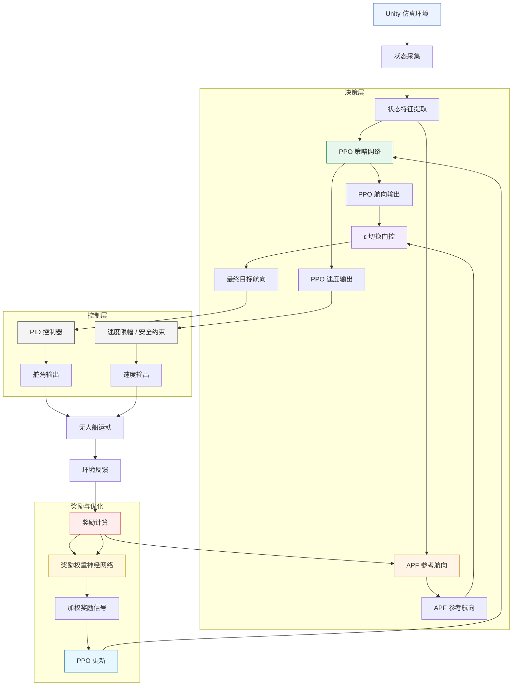
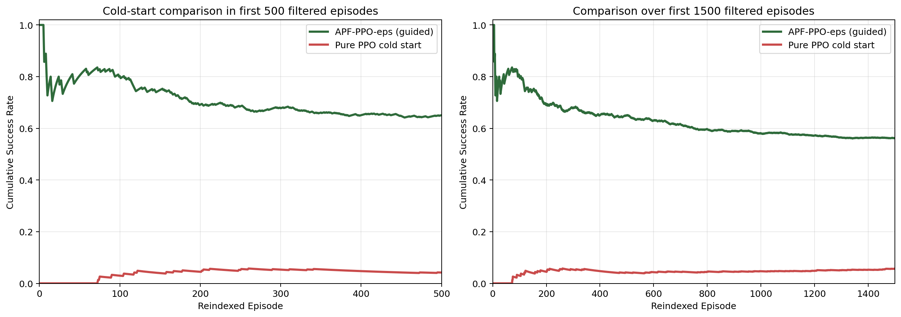
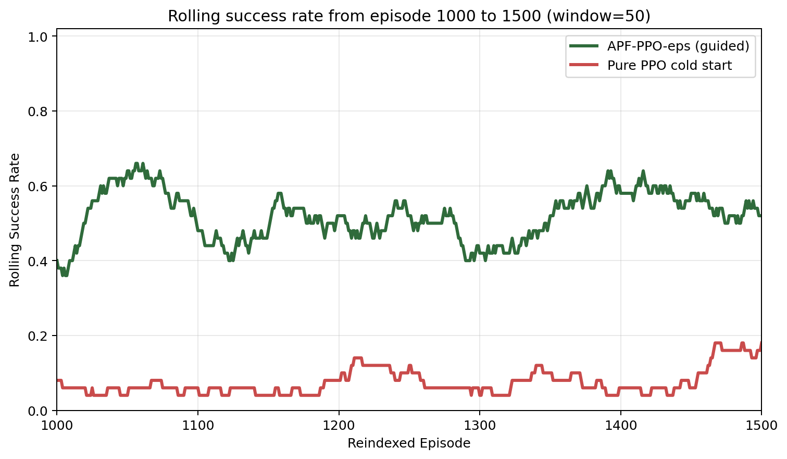

# 1. 赛题理解与任务目标
## 1.1 赛题分析
本赛题旨在基于 `Unity` 仿真环境，通过强化学习算法使无人船具备自主避障与目标导航能力。比赛的核心目标，是设计兼具避障性能、导航能力与工程可实现性的算法程序，并通过官方仿真平台验证其有效性与稳定性。

## 1.2 任务难点分析
结合官方仿真平台、操作手册与示例代码，我们认为本赛题主要存在以下难点：

+ 需要平衡无人船在目标趋近与障碍规避之间的优先关系。
+ 仿真环境受到真实物理条件约束，存在理想控制输出与实际执行结果间的偏差。
+ 传统算法可解释性较强，但自适应能力与泛化能力有限；`PPO` 等强化学习方法具备自主学习能力，但通常存在启动慢、探索不稳定、训练收敛周期长等问题。
+ 若仅采用稀疏终止奖励，强化学习难以高效学习有效策略。

# 2. 总体技术路线
## 2.1 方案概述
为实现比赛目标，本项目采用 `PPO`（近端策略优化）与 `APF`（人工势场法）相结合的 `APF-PPO-ε` 混合控制模式，并在 `Unity` 交互端通过 `PID` 控制器将 `PPO/APF` 输出的目标航向转换为实际舵量，以缓解物理阻力与执行滞后带来的影响。同时，项目设计了多级多元化奖励机制，并结合奖励权重神经网络对奖励信号进行动态调节，从而引导无人船形成更合理的航行策略。

## 2.2 方案选择理由
在强化学习方法的选择上，本项目采用 `PPO` 作为核心算法。该方法属于典型的策略梯度算法，通过裁剪目标函数限制策略更新幅度，能够在连续控制任务中兼顾训练稳定性与工程可实现性。

在先验引导设计上，本项目引入 `APF` 思想。一方面，`APF` 能够为传统方法与强化学习方法的结合提供清晰接口；另一方面，目标引力场与障碍斥力场的构造方式，也为奖励函数与参考航向设计提供了直接依据。

在策略切换设计上，我们注意到纯 `PPO` 在训练早期较难平衡“探索”与“利用”，随机探索往往难以及时产生有效样本，从而导致启动缓慢、训练成本较高。因此，项目设计了基于专家因子 `ε` 的 `APF-PPO-ε` 切换机制，使无人船在训练初期更多依赖 `APF` 获取高质量样本，在训练后期逐步回归 `PPO` 主导，以提升整体训练效率。

在执行层设计上，`PID` 控制器主要作为底层航向执行模块引入。由于 `PPO` 与 `APF` 输出的本质上都是目标方向，而仿真平台中的船舶控制需要连续、平滑且受约束的控制量，因此有必要在决策层与执行层之间加入 `PID` 控制环节，以提高输出动作的稳定性与可执行性。

# 3. 关键模块设计
## 3.1 APF 参考航向设计
为便于后续介绍，先说明人工势场法（`APF`）的基本思想。

在 `APF` 中，目标点通常被建模为具有吸引作用的势场源，障碍物则被建模为具有排斥作用的势场源。无人船在某一时刻所受到的合力方向，可以理解为目标吸引力与障碍排斥力共同作用后的结果。基于这一思想，`APF` 不仅能够为无人船提供连续、直观的航向指引，还能够在“趋近目标”与“规避障碍”之间建立统一的方向约束。

若记当前船舶与目标点的距离为 $ d $，目标方向的世界坐标航向为 $ \psi_t $，则引力项可写为：

$ F_{att} = k_a d $

$ \mathbf{F}_{att} =
F_{att}
\begin{bmatrix}
\cos \psi_t \\
\sin \psi_t
\end{bmatrix} $

其中，$ k_a $ 为引力系数。其含义是：无人船距离目标越远，引力向量越强，从而更明显地驱动船体朝目标方向收敛；当船体逐渐接近目标时，引力强度随距离减小而减弱，以避免在目标附近产生过大的方向震荡。

对于障碍物斥力场，项目仅对进入有效影响范围内的障碍物施加斥力。若记船体与最近障碍物的距离为 $ \rho $，障碍物有效影响半径为 $ \rho_0 $，则当 $ \rho \ge \rho_0 $ 时不施加斥力；当 $ \rho < \rho_0 $ 时，斥力势场可表示为：

$ U_{rep} = \frac{1}{2}k_r\left(\frac{1}{\rho} - \frac{1}{\rho_0}\right)^2 $

其对应的斥力大小为：

$ F_{rep} = k_r\left(\frac{1}{\rho} - \frac{1}{\rho_0}\right)\frac{1}{\rho^2} $

其中，$ k_r $ 为斥力系数。斥力方向与障碍物方向相反，因此斥力向量会沿障碍物相对方向的反方向叠加到总势场中。当障碍物距离较远时，系统几乎只受引力主导；当障碍物逐渐逼近时，斥力会快速增强，从而促使船体主动偏离危险区域。

结合本赛题，若记目标吸引向量和障碍排斥向量分别为 $ \mathbf{F}_{att} $ 和 $ \mathbf{F}_{rep} $，则 `APF` 的合成势场向量可表示为：

$ \mathbf{F}_{apf} = \mathbf{F}_{att} + \mathbf{F}_{rep} $

对应的 `APF` 世界坐标航向可由反正切函数求得：

$ \psi_{apf} = \mathrm{atan2}(F_{apf,y}, F_{apf,x}) $

进一步地，考虑到控制输入通常与船体当前航向相关，代码中最终采用的是 `APF` 航向相对于当前船体航向的偏差值：

$ \Delta \psi_{apf} = \mathrm{normalize}(\psi_{apf} - \psi_{ship}) $

_图 3-1 APF 参考角度示意图_

由此即可得到基于 `APF` 的预期输入 `apf_heading`。从图 3-1 可以看出，`apf_next` 与无人船的局部合理前进方向具有较高一致性。该角度由当前状态中的 `obstacle_min_range`、`obstacle_angle`、`current_distance` 与 `degreeAship` 等变量共同决定，并广泛用于后续的航向奖励、障碍惩罚以及 `APF-PPO-ε` 策略切换。

## 3.2 PPO 策略设计
### 3.2.1 状态空间与动作空间
当前 `PPO` 采用 96 维连续状态空间，其构成为：

+ 90 维 `scan_range` 雷达数据
+ 当前速度 `current_speed`
+ 当前角速度 `current_rotate_speed`
+ 航向误差 `angle_diff`
+ 到目标距离 `current_distance`
+ 最近障碍距离 `obstacle_min_range`
+ 障碍相对角度 `obstacle_angle`

其中，`scan_range` 包含无人船前方 180° 范围内的雷达数据。为避免输入过于密集，项目按 1° 间隔进行降采样，从而在保留主要空间信息的同时降低计算开销。

这样的状态空间设计使得各状态量均以无人船为参照进行表达，从而保证训练在采用随机目标点、随机初始位置和随机障碍布局时仍具有较好的稳定性与适用性。

动作空间采用 2 维连续动作，其形式为：

$ \mathcal{A} = (\theta, v) $

其中，$ \theta $ 为预期转向角度，并映射到 $ (-90^\circ, 90^\circ) $；$ v $ 为预期速度。

### 3.2.2 网络结构
在网络结构设计上，本项目采用改进的 `Actor-Critic` 双网络结构。根据代码实现，网络首先经过两层共享特征提取层，每层维度均为 256，并在线性变换后加入 `LayerNorm` 与 `SiLU` 激活函数，以增强特征表达能力并提升训练稳定性。共享特征层可概括为：

$ h_1 = \mathrm{SiLU}(\mathrm{LayerNorm}(W_1 s + b_1)) $

$ h_2 = \mathrm{SiLU}(\mathrm{LayerNorm}(W_2 h_1 + b_2)) $

其中，$ s $ 表示输入状态，$ h_2 $ 为共享特征表示。基于该特征表示，`Actor` 分支输出动作均值，`Critic` 分支输出状态价值：

$ \mu = \tanh(W_a h_2 + b_a) $

$ V(s) = W_c h_2 + b_c $

其中，$ \mu $ 对应二维连续动作 $ (\theta, v) $ 的均值向量，$ V(s) $ 为当前状态价值。采用 $ \tanh $ 作为输出约束，主要是为了将策略输出稳定映射到有限区间内，避免控制量在训练初期出现过大波动。

### 3.2.3 更新设计
#### 3.2.3.1 动作方差的更新设计
由于本任务属于连续动作控制问题，`Actor` 网络除输出动作均值外，还需要描述动作分布的离散程度。因此，本项目采用由独立可训练参数控制动作方差的设计。

具体而言，`Actor-Critic` 网络首先通过共享特征提取层和 `Actor` 输出头得到二维动作均值向量 $ \mu(s) $，分别对应转向控制与速度控制；与此同时，系统额外维护一个长度等于动作维度的对数标准差参数向量：

$ \log \boldsymbol{\sigma} = [\log \sigma_1, \log \sigma_2] $

该参数随策略参数一起交由优化器更新。代码中通过 `nn.Parameter` 对其进行维护，初始值统一设为 `ACTION_STD_INIT = 0.45` 对应的对数标准差，因此初始时 $ \sigma_1 = \sigma_2 $；但在后续训练过程中，两者会分别接收各自动作维度上的梯度并独立更新。任意时刻的动作协方差矩阵可表示为：

$ \Sigma = \mathrm{diag}(\sigma_1^2, \sigma_2^2) $

其中，$ \sigma_i = \exp(\log \sigma_i) $，分别表示转向动作与速度动作的探索强度。

策略采样时采用多元高斯分布：

$ a \sim \mathcal{N}(\mu, \Sigma) $

这种设计使智能体在训练早期能够尝试不同的控制组合，并能够随着训练推进自动调整探索强度，而无需额外手工设计退火规则。

为防止方差过大导致动作过于随机，或方差过小导致策略过早收缩，代码中还对 $ \log \sigma $ 进行了截断：

$ \log \sigma \in [-3.0, -0.3] $

_图 3-2 动作方差收敛过早时的航行表现_

#### 3.2.3.2 GAE 优势函数设计
在策略更新阶段，本项目采用广义优势估计（Generalized Advantage Estimation，`GAE`）计算优势函数。与直接使用单步时序差分误差相比，`GAE` 能够在偏差与方差之间取得更好的平衡，更适合奖励波动较大的导航任务。其递推形式为：

$ \delta_t = r_t + \gamma V(s_{t+1}) - V(s_t) $

$ A_t = \delta_t + \gamma \lambda A_{t+1} $

其中，$ \gamma = 0.99 $ 为折扣因子，$ \lambda = 0.95 $ 为 `GAE` 参数。其余更新流程与原始 `PPO` 论文及官方示例代码的基本设计保持一致。

#### 3.2.3.3 PPO 裁剪更新设计
在策略优化阶段，本项目延续 `PPO` 的核心思想，采用裁剪目标函数限制新旧策略之间的偏移幅度，以降低策略更新过快导致训练震荡甚至性能退化的风险。若记新旧策略概率比为

$ r_t(\theta) = \dfrac{\pi_{\theta}(a_t \mid s_t)}{\pi_{\theta_{old}}(a_t \mid s_t)} $，

则其裁剪目标函数可写为：

$$
L^{clip}(\theta) =
\mathbb{E}_t \left[
\min\left(
r_t(\theta) A_t,\;
\operatorname{clip}(r_t(\theta), 1 - \epsilon, 1 + \epsilon) A_t
\right)
\right]
$$

其中，$\epsilon$ 为裁剪系数。在本项目实现中，`EPS_CLIP = 0.2`，即当策略更新导致概率比偏离区间 $[0.8, 1.2]$ 时，目标函数将对其增益进行截断。该设计能够在保留策略改进能力的同时，抑制单次更新过大的不稳定影响，与前述 `GAE` 优势估计共同构成当前 `PPO` 更新设计的核心。

## 3.3 奖励函数设计
当前总奖励主要由以下几部分组成：

+ 距离奖励
+ 朝向奖励
+ 障碍物惩罚
+ 时间惩罚
+ 步数惩罚
+ 到达奖励 / 碰撞惩罚

### 3.3.1 距离奖励
当前距离奖励由两部分组成：

+ `progress_reward`
+ `proximity_reward`

其中，`progress_reward` 用于衡量“相较于上一步，当前是否更接近目标”，其可表示为：

$ progress = prev\_distance - current\_distance $

`proximity_reward` 用于衡量“当前是否已经接近目标”，采用类似吸引势场的指数形式。距离越近，该项越大，但其取值不会超过 `arrive_bonus`，且整体权重相对较低，以避免策略通过局部停留获取非合理高分：

$ proximity = \exp\left\{-k\frac{current\_distance}{distance\_scale}\right\} $

其中，`distance_scale` 一般取当前回合中目标距离的最大值。

### 3.3.2 朝向奖励
朝向奖励衡量当前航向与 `APF` 参考方向之间的偏差。`APF` 方向可视为目标引力与障碍斥力合成后的结果，并在实际实现中分别通过 `apf_attractive_gain` 与 `apf_repulsive_gain` 对引力项和斥力项进行增益调节。

### 3.3.3 障碍物惩罚
`obstacle_reward` 本质上是一个基于斥力场思想构建的惩罚项，其计算方式与 `APF` 参考航向设计中障碍物斥力场的构造方法一致。

### 3.3.4 时间惩罚
时间惩罚项定义为：

$ w(t) = w_{\min} + (1 - w_{\min}) \exp\left(-4 \cdot \operatorname{clip}\left(\frac{t}{T_{\max}}, 0, 1\right)\right) $

随着时间增加，该惩罚项会逐步增大，从而抑制无人船无效徘徊或过度保守的行为。

### 3.3.5 其它奖励项
此外，项目还设置了若干终止型或辅助型奖励项：

+ 步数惩罚：`step_penalty`，每一步施加固定小惩罚，用于抑制无意义拖延。
+ 到达奖励：`reward_arrive_bonus`，成功到达目标时给予明确的大额正奖励。
+ 碰撞惩罚：`reward_collision_penalty`，发生碰撞时给予明确的负奖励。

需要说明的是，原官方代码中到达奖励与碰撞惩罚的绝对值设置较高，相比之下容易使连续奖励显得过于稀疏。因此，本项目将其调整为 `80` 与 `-50`，以改善奖励信号的层次结构。

## 3.4 奖励权重神经网络
奖励权重神经网络的主要作用，是对不同奖励分量进行自适应加权，使训练过程能够根据当前状态与训练阶段，动态调整各奖励项对策略学习的影响强度。其设计目标并非替代原有人工奖励结构，而是在保留距离奖励、朝向奖励与障碍惩罚可解释性的基础上，提高奖励组合的灵活性。

从功能流程上看，环境首先计算基础奖励分量，再由奖励权重网络对各分量进行加权整合，最终生成用于 `PPO` 更新的综合奖励信号。这样做的潜在优势在于：不同训练阶段对奖励的侧重点并不相同，训练早期更强调“快速形成有效到达行为”，训练中后期则更关注“提高避障稳定性与路径质量”，固定权重设计往往难以同时兼顾这两类需求。

不过，从当前实验情况看，该模块与 `Actor/Critic` 网络的联合训练仍存在较强耦合性，容易放大奖励波动和价值估计误差，从而影响整体收敛稳定性。因此，在现阶段分析中，我们将其视为具有潜力的扩展方向，而非已经完全稳定的核心模块。后续工作仍需围绕其训练方式、接入时机与参数约束开展进一步优化。

## 3.5 PID 控制设计
`PID` 在本项目中主要承担执行层功能，其作用是将 `APF` 或 `PPO` 输出的目标航向转换为更平滑、可执行的舵角指令。由于 `PID` 本身属于传统控制方法，并非本项目的创新点，因此这里主要将其作为稳定执行的基础模块引入。

具体实现上，系统先计算目标航向与当前船体航向之间的误差，再由 `PID` 根据比例项、积分项与微分项输出控制量。该过程的主要作用不是改变上层决策逻辑，而是减弱强化学习输出可能带来的波动，使控制指令更符合仿真平台中的实际执行特性。

因此，在本项目的混合控制框架中，`PID` 主要用于统一不同来源的航向指令，并提高控制过程的连续性与稳定性。后续设计的重点仍然集中在 `PPO` 的策略学习、`APF` 的参考航向生成以及两者之间的切换机制上。

## 3.6 APF-PPO-ε 策略切换机制
`APF-PPO-ε` 策略切换机制的核心思想是：在训练早期尽可能利用 `APF` 提供的先验方向，以提高有效样本的生成比例；在训练后期逐步减少 `APF` 的参与，使 `PPO` 能够依靠自身策略完成主要决策。换言之，该机制旨在缓解 `PPO` 初期启动慢、探索不稳定和收敛缓慢的问题。

从实现方式上看，`APF` 给出的预期角度记为 `apf_pred`，它由人工势场法计算得到；在每一个 step 中，`PPO` 也会根据当前状态输出一个预期角度 `ppo_pred`。前者提供稳定的方向先验，后者提供策略网络学习得到的动作输出。

在训练初期，`PPO` 的探索性较强，若完全依赖其输出，容易导致成功率偏低、碰撞样本过多。为此，本项目引入专家因子 $ \epsilon $ 控制 `APF` 的参与程度，其计算方式为：

$ \epsilon = \max(\epsilon_{min}, e^{-k \cdot \max(0, episode)}) $

其中，$ \epsilon_{min} $ 为专家概率下限，$ k $ 为衰减系数，`episode` 表示当前训练回合。

在实际训练中，系统在初期几乎总是采用 `APF` 生成的参考航向作为执行目标，以帮助 `PPO` 优先获得足够多的成功样本；随着训练回合增加，$ \epsilon $ 会逐渐衰减到下限，`APF` 的参与频率也随之降低。

当教师概率降低到较低水平后，控制过程将逐步转为以 `PPO` 为主导，以避免训练后期对人工先验产生过度依赖，使策略网络最终能够独立完成决策。因此，该机制既保证了训练早期的样本质量，也为后期策略收敛预留了优化空间。

_图 3-3 `APF-PID` 早期成功率示意_

# 4. 实验结果
## 4.1 实验设置
1. 仿真环境配置：
+ 场地大小：40 m × 40 m
+ 障碍物数量：10
+ 障碍物位置：固定
+ 智能体生成位置：随机
+ 目标点生成位置：随机

2. 算法配置：
+ 训练轮数：6500 轮，并采用 `APF-PPO-ε` 模式
+ 专家因子 $ \epsilon $ 衰减系数 $ k = 0.001 $
+ 专家因子下限 $ \epsilon_{min} = 0.1 $

3. 评价指标：
+ 成功率 / 碰撞率
+ `Actor / Critic` 网络损失函数
+ `PPO` 探索熵
+ 平均回报
+ 回合平均时长

## 4.2 初步实验结果与分析

_图 4-1 回合累计成功率与 PPO 更新累计成功率_

_图 4-2 当 $\epsilon < 0.3$ 时的累计成功率与 50 回合窗口成功率_

结合上述可视化结果，可以对当前方法的训练表现作出初步分析。首先，系统在训练初期具有较高的成功率。这说明 `APF-PPO-ε` 策略切换机制在初期阶段能够有效发挥作用，借助 `APF` 的参考航向为策略网络提供较高质量的引导样本。

然而，随着训练推进，成功率并未持续单调上升，而是先下降、后缓慢回升，最终稳定在中等水平附近。以本次训练的 6465 个训练回合为例，累计成功率约为 $ 57.01\% $；若剔除 `step < 5` 的无效回合，累计成功率可提升至 $ 62.03\% $。对应地，累计碰撞率约为 $ 42.99\% $；在剔除无效回合后，该值约为 $ 37.93\% $。这表明当前方法虽然已经具备一定的自主导航与避障能力，但在复杂障碍环境下，尤其是在专家因子逐步缩减后，仍存在较明显的失效率，后期收敛质量仍有提升空间。

从单回合表现来看，最近 100 个回合的成功率约为 $ 65.0\% $，最近 500 个回合的成功率约为 $ 63.0\% $，均高于全程累计成功率。这说明当前策略在逐步脱离 `APF` 引导后，仍具备一定的持续优化能力，并在经历较长时间波动后逐步恢复到相对稳定的水平。但与此同时，最近 500 个回合的碰撞率仍达到 $ 36.8\% $，说明避障稳定性尚未达到理想状态。

为进一步验证 `APF-PPO-ε` 机制在冷启动阶段的作用，本项目补充进行了另一组对比实验 `Results/ppo_nav_20260623_221500`。该组实验未使用 `APF-PID` 教师引导，仅采用纯 `PPO` 从零开始训练。考虑到原始日志中存在无效回合与回合编号断点，冷启动对比统一采用两组实验各自的 `episode_metrics_filtered_reindexed.csv` 作为统计口径。对比发现，两组实验在冷启动阶段表现差异显著：含 `APF` 引导的方案在前 50 个回合的累计成功率约为 $ 80.0\% $，前 100 个回合约为 $ 80.0\% $；而无引导纯 `PPO` 在前 50 个回合成功率为 $ 0 $，前 100 个回合仅约为 $ 3.0\% $。同时，含引导方案在第 0 回合即出现成功样本，而纯 `PPO` 直到第 73 回合才首次成功到达目标。这一结果表明，`APF` 提供的参考航向对提高早期有效样本比例、缩短探索盲区具有明显作用。

_图 4-3 基于过滤重编号回合的冷启动成功率对比_

从整体训练结果看，在相同的过滤重编号口径下，无引导纯 `PPO` 的累计成功率仅约为 $ 5.68\% $，累计碰撞率约为 $ 94.06\% $，累计平均回合时长约为 25.32 s，累计平均步数约为 65.73 步；而 `APF-PPO-ε` 方案的累计成功率约为 $ 62.41\% $，累计碰撞率约为 $ 37.59\% $，累计平均回合时长约为 16.98 s，累计平均步数约为 42.56 步。尤其是在前 500 个过滤后回合内，纯 `PPO` 的累计成功率仅约为 $ 4.2\% $，而含引导方案约为 $ 65.0\% $。由此可以认为，`APF-PPO-ε` 并不仅仅改善了训练初期的视觉表现，而是实质性提升了冷启动阶段的可学习性与样本有效性，为后续策略收敛奠定了更好的基础。

为了进一步比较两种方法在中后期的稳定表现，基于同样的过滤重编号口径，图 4-4 给出了第 1000 至 1500 回合区间内、以 50 回合为窗口计算的滚动成功率对比。可以看到，`APF-PPO-ε` 方案在该区间内总体维持在约 $ 0.36 \sim 0.66 $ 的范围内波动，平均窗口成功率约为 $ 52.02\% $；相比之下，无引导纯 `PPO` 在相同区间仅维持在约 $ 0.04 \sim 0.18 $ 的较低水平，平均窗口成功率约为 $ 7.40\% $。在统一回合区间后，含引导方案依然显著优于纯 `PPO` 冷启动方案，这说明 `APF` 先验不仅改善了训练早期的探索效率，也对中后期的稳定表现具有持续正向作用。

_图 4-4 第 1000 至 1500 回合区间的 50 回合窗口成功率对比_

_图 4-5 回合平均时长与回合平均步数_

_图 4-6 回合平均回报_

从效率指标来看，回合平均时长、平均步数以及回合平均回报整体经历了“先下降、后上升、再回落”的变化过程。训练初期，在 `APF` 先验的帮助下，智能体能够较快抵达目标，各项指标均明显改善；中期随着 `PPO` 逐步接管决策，探索波动使平均步数和平均时间有所上升，同时碰撞率增加也使回报出现明显下降；后期三项指标重新回落并趋于平稳。当前累计平均回合时长约为 15.22 s，累计平均步数约为 38.16 步，最近 500 个回合的平均回合时长约为 14.30 s，平均步数约为 35.86 步。

_图 4-7 _`Actor`_ 网络损失函数_

_图 4-8 _`Critic`_ 网络损失函数_

从优化过程来看，`Actor` 损失整体幅值较小，主要围绕 0 附近振荡，说明策略更新步长总体较为温和，未出现明显的梯度发散现象。相比之下，`Critic` 损失波动较大，既存在较长时间的高频起伏，也存在多个尖峰点；结合统计结果，其最大值超过 4000，末段仍处于数百量级。这表明价值网络对回报的拟合稳定性仍然不足，状态价值估计误差较大，进而可能影响优势函数估计质量和策略更新方向。

_图 4-9 探索熵变化曲线_

探索熵在训练过程中虽呈缓慢下降趋势，但整体变化幅度不大，末段仍保持在 1.22 左右。这说明当前策略尚未快速塌缩，仍保留一定探索性。从积极角度看，这有助于避免过早陷入局部最优；但从结果表现来看，也说明当前策略的利用能力尚未充分建立，即探索仍然存在，而稳定有效的决策模式尚未完全形成。

综合上述结果可以认为，`APF-PPO-ε` 已经体现出较好的训练启动能力和一定的后期恢复能力。`APF` 的引导作用有效缓解了纯 `PPO` 在训练初期样本质量不足的问题，`PID` 执行层也保证了控制输出的基本平滑性。但从当前实验结果看，系统仍主要停留在“已经能够学到有效行为，但尚未实现稳定收敛”的阶段。

# 5. 当前问题与下一阶段计划
## 5.1 当前问题
结合当前实验结果，项目仍存在以下几个主要问题：

+ 无人船航迹仍存在较明显的抖动现象，控制输出的平滑性有待进一步提升。

_图 5-1 抖动的无人船航迹_

+ `PPO` 的独立性能提升尚不充分，`APF-PPO-ε`的协同关系仍需进一步调节。
+ 当前有效样本规模仍然有限，尚不足以充分验证不同参数设置与算法组合的效果。
+ 奖励权重神经网络与 `Actor/Critic` 网络的联合训练耦合较强，容易导致训练不稳定甚至不收敛。
+ 成功率窗口曲线波动较大，说明策略在中后期缺乏稳定的泛化表现。
+ `Actor` 与 `Critic` 网络波动仍较大，说明当前 `PPO` 尚未实现充分且稳定的有效收敛。

## 5.2 优化方向
下一阶段将重点围绕以下几个方向开展优化：

+ 将仿真训练部署至服务器环境，扩大训练规模，延长训练轮次，提高实验效率。
+ 获取更多纯 `PPO`、纯 `APF` 以及 `Dijkstra` 势场等方法的实验数据，开展对比实验与消融实验，以识别更优的参数设置与算法组合。
+ 优化 `ε` 的衰减策略与 `APF` 退出节奏，使先验引导与自主学习之间的过渡更加平滑。
+ 进一步调整奖励函数设置及其权重分配，增强对高质量避障行为的正向引导，并抑制高风险动作。
+ 寻求更好的路径规划/输出控制算法，增强无人船运动的稳定性与可控性。
+ 采用更有针对性的评估策略，例如通过下列公式估计在剔除 `APF` 指导后纯 `PPO` 的成功率水平：

$$
b(a \mid s) = \varepsilon \cdot \mathbf{1}_{\{a = a_{\text{APF}}(s)\}} + (1 - \varepsilon) \cdot \pi_{\text{PPO}}(a \mid s)
$$

$$
w(\tau) = \prod_{t=0}^{T-1} \frac{\pi_{\text{PPO}}(a_t \mid s_t)}{b(a_t \mid s_t)}
$$

$$
\hat{J}_{\text{PPO}} = \frac{1}{N} \sum_{i=1}^{N} w(\tau_i) \cdot R(\tau_i)
$$

通过上述方式，可以在不完全依赖额外纯 `PPO` 长周期训练的情况下，对当前策略的独立表现进行辅助估计。

## 5.3 预期成果
通过上述优化，预期能够在保持现有导航效率的基础上，进一步提升训练后期的稳定性与成功率，降低碰撞率，并增强策略在复杂障碍环境中的泛化能力。

同时，期望 `PPO` 在逐步脱离 `APF` 强引导后，能够形成更稳定的自主决策能力，使成功率曲线在中后期表现出更明显的上升趋势，而非长期处于大幅波动状态。

最终，希望构建出一套兼具可解释性、稳定性与竞赛适用性的无人船自主导航方案，为后续测试验证、参数定型与正式参赛提供可靠支撑。

# 6. 团队分工
组长：刘镒荣

+ `PPO` 算法设计及改进、导航算法设计及改进：刘镒荣、闫少卿
+ 奖励函数设计：刘镒荣、孙梦洋、董文彬
+ 奖励权重神经网络设计：孙梦洋
+ `PPT` 制作、视频制作：胡铁严
+ 论文收集与整理：全体成员
+ 答辩：刘镒荣

# 参考文献
[1] Schulman J, Wolski F, Dhariwal P, et al. Proximal policy optimization algorithms[J]. arXiv preprint arXiv:1707.06347, 2017.

[2] Khatib O. Real-time obstacle avoidance for manipulators and mobile robots[J]. The International Journal of Robotics Research, 1986, 5(1): 90-98.

[3] Xu X, Zhang C, Zhang W. APF guided reinforcement learning for ship collision avoidance[C]//Proceedings of the 14th International Conference on Quality, Reliability, Risk, Maintenance, and Safety Engineering (QR2MSE). 2024.

[4] Nguyen V B, Nguyen P T. Adaptive Correlation-Weighted Intrinsic Rewards for Reinforcement Learning[J]. arXiv preprint arXiv:2602.24081, 2026.

[5] Zhang J, Lei C, Dai C, et al. High-speed vision-based flight in clutter with safety-shielded reinforcement learning[J/OL]. arXiv, 2026. [https://arxiv.org/abs/2602.08653](https://arxiv.org/abs/2602.08653)
